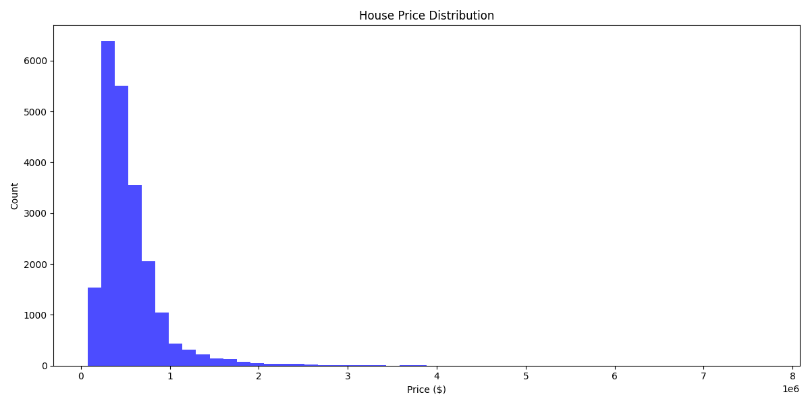
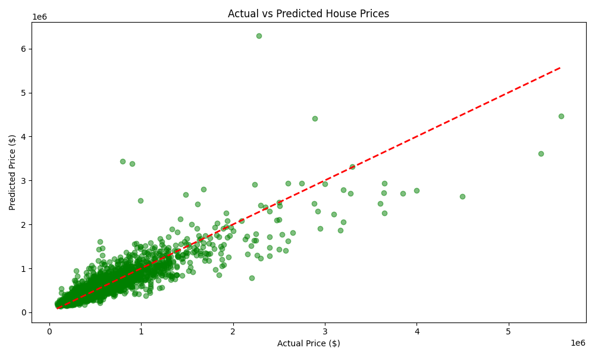
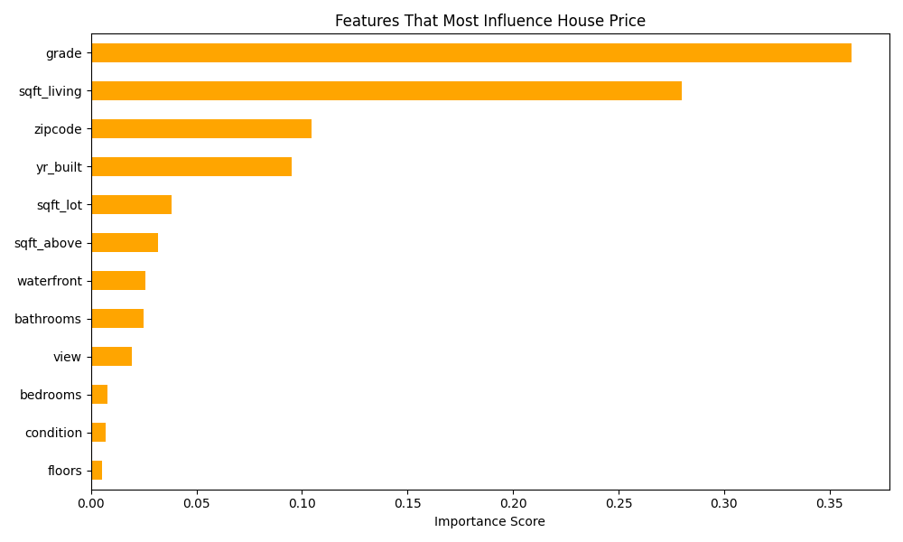

# House Price Predictor

A machine learning model that predicts house prices with 78% accuracy using Random Forest — trained on 21,613 real house sales from King County, USA.

## Overview

Buying a house is the biggest financial decision most people make in their lifetime. Yet most buyers have no data-driven way to know if a house is fairly priced or overpriced. This project builds a predictive model that estimates house prices based on key features — giving buyers and sellers a data-driven reference point.

## Results

| Model | MAE | R2 Score |
|-------|-----|----------|
| Linear Regression | $143,734 | 0.6522 |
| Random Forest | $91,366 | 0.7782 |

Random Forest outperforms Linear Regression by 13% — predicting house prices with 78% accuracy and an average error of just $91,366 on houses ranging from $75,000 to $7,700,000.

## Key Finding

Grade — the overall quality rating of the house — is the strongest predictor of price. Better construction quality and finishing materials matter more than number of bedrooms or bathrooms.

## Charts

### Price Distribution


### Actual vs Predicted Prices


### Feature Importance


## How to Run

```bash